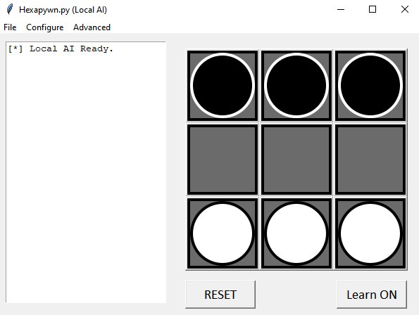

# hexapawn.py

> **Before using this repository, please bear in mind that any code/files used may be used as evidence for a Non-Exam Assessment under my taking of OCR's A-Level Computer Science Course. As such, *using this code for an NEA of your own is strictly prohibited.* This means you may not use it (or any variants) for your own work. You may still use this code for personal use.**

The code in this Repository is aimed to help people learn the basics of machine learning, by using an obscure chess variant known as "Hexapawn". This game was invented solely to demonstrate machine learning and takes inspiration from the MENACE computer which was capable of playing (and learning to improve at) tic-tac-toe

## What is Hexapawn?

Hexapawn was invented by Martin Gardner, who was a writer in Popular Mathematics. He focused on recreational maths and so as a writer, he would create games in his own column for *Scientific American*, titled "Mathematical Games". Hexapawn is just one of the many games he created.

In Hexapawn, you and another player (Typically, an AI) play on a 3x3 chess board, and you each have three pawns on your side of the board, in this configuration:

Your pawn can move as it typically would in Chess, *except no pawn can move two spaces forward on its first move*. So, you can move forward one space if it is unoccupied, or diagonally to the left or right if there is an opponent piece there (you remove that opponent piece from play). You win the game by either:

- Capturing all your opponent's pieces;
- Getting one of your own pieces to the opposite side of the board or;
- Forcing your opponent into a state where they cannot move, by blocking their pieces.

This game has around the same gameplay value as tic-tac-toe or rock-paper-scissors, so don't throw out your PS5s and Xboxs just yet...

## How does the AI learn?

Really, the AI picks moves randomly. It just changes its probabilites of picking each move as it learns how to play the game. It is learning by reducing the chance it picks a poor move and increasing the chance it picks a good move. Sound underwhelming? Likely because it is. Clearly, this is a very high-level explanation, so take it with a grain of salt.

If you want to see this in practice, you should not only try out the Python Program in this repository, but also check out [this video](https://www.youtube.com/watch?v=sw7UAZNgGg8) by Vsauce2, where he does exactly the same thing, but with matchboxes. Although, he does play a variant of Hexapawn that he dubs "Shreksapawn", but it plays exactly the same. It'll make sense when you watch the video. Oddly enough, this is what inspired me to create this program!

## How do I use the program?

Start by clicking the green "Code" button and select "Download ZIP". Once downloaded, extract the file contents and execute the [hexapawn.py](hexapawn.py) file (Make sure you have python installed for obvious reasons!). You should be greeted to this interface:

Try clicking on squares containing white pieces and then selecting where you want to move. You can click the same space again to de-select that piece. When a game ends, click 'RESET' to play another game. If you want the AI to stop learning from games, click "Learn ON". It should change to "Learn OFF". Click again to re-enable learning.

You should not be required to modify anything in the code to get this to work.

## Is there anything else I can do?

Yes! There are plenty of other tools available in this application, as well as room for creating your own code to get the app to do what you want. Below is a set of contents of guides:

- [Save and Load AI](guides/saving-and-loading.md)
- [Training and Testing](guides/automate-games.md)
