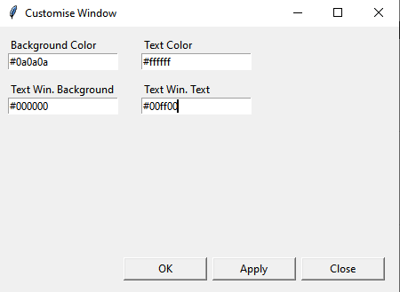
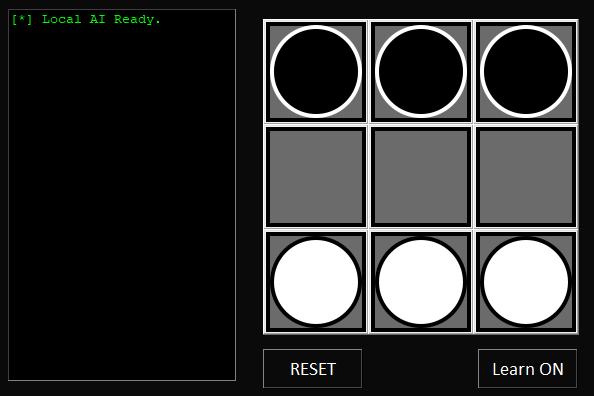

# The Advanced Options Menu

There are a couple extra options you can take advantage of in the UI.

## Adjust the AI Learn Factor

Before we go into changing the AI learning factor, what *is* it? It's exactly what it says on the tin: the rate at which the AI will learn. The higher, the faster it learns. This factor can be any decimal between 0 and 1. Try changing it to different numbers and seeing what happens!

## Console Mode

If a User Interface isn't your cup of tea, you can try using the limited functionality of the console mode. Once you click this option, the UI will close and you'll need to proceed on the console window, which should output this:

```
To return to the GUI, press Ctrl+C and re-run the program.
    A   B   C  
  +---+---+---+
1 |BP1|BP2|BP3|
  +---+---+---+
2 |   |   |   |
  +---+---+---+
3 |WP1|WP2|WP3|
  +---+---+---+
Select Piece:  
>
```

At this point, you can pick a space by typing the code you want, such as `a3`. You can play as many games as you like, and once you're done, you can close the window or hit Ctrl+C to end the program. The learning option will be turned on if it was on when you switched to console mode.

## Customise the Root UI

If for whatever reason you want to change how the UI looks, you can use this option to change it. You can change:

- Background of the Window
- Text color
- Background of the status pane
- Text color of the status pane

You can enter any tkinter-compatible color format, I recommend using hex values. Here's an example I made:



Here are the values I entered...



And Presto! Dark Mode Hexapawn! With a hacker aesthetic too!