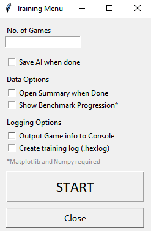
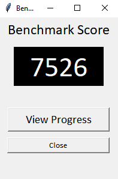
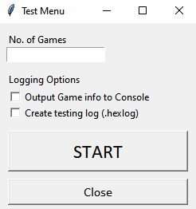

# Speed up Training and Testing

You can train your AI by playing several games with it (with Learning enabled, of course.). This is great, except it's very time consuming. This is where the training, testing and benchmark functions come into play.

> *Note*: The term "Master Player" Refers to the algorithm used to replace a human player when automating games.

## Training AI

In the top-left corner, click "Configure", then select "Train AI" from the drop-down menu. The following window should pop up:

- **No. of Games** - Specify the number of games you want to run in this session. This entry must be filled.
- **Save AI when Done** - Open a prompt to save your AI when training is finished.
- **Show Benchmark Progression** - Show the AI's change in benchmark score (See Below)
- **Output Game info to Console** - Write every move the AI and Master Player makes in every game and each game's outcome to the console window.
- **Create Training Log** - Output all game data to a `.hexlog` file. You can open these files in any text editor as plain text.

Once you're done configuring the various settings, click "START" and wait until the window closes or any other prompts come up. Remember that large quantities of games will take a while to complete, and creating logs will increase the time each game takes.

## Benchmarking

Benchmarking in this context refers to the scoring method used to compare AI relative to each other. It can range anywhere between 23,000 and -22,000 and is calculated by accumulating the AI's chances of choosing good or bad moves. Good moves increase the score, bad ones reduce it.

The benchmark score is calculated after every training game and there is an option to view the progression in the form of a line graph, but this requires `numpy` and `matplotlib` to be installed beforehand. If these are not installed, the options to plot graphs will be disabled.

To view the current benchmark score, click "Configure", then "Benchmark AI". You should see this window pop up:

The number on the window will most likely be different to what you see here, and it will depend on how many games you have trained the AI with. Clicking "View Progress" will show you the progress of the AI so far in terms of its benchmark score.

## Test AI

You can assess AI not only by benchmark score, but also by Win/Loss ratio, and this can be achieved by testing the AI. To do this, click "Configure" then "Test AI". This is what you should see:

- **No. of Games** - Specify the number of games you want to run in this session. This entry must be filled.
- **Output Game info to Console** - Write every move the AI and Master Player makes in every game and each game's outcome to the console window.
- **Create Training Log** - Output all game data to a `.hexlog` file. You can open these files in any text editor as plain text.

Click "START" when ready, then once the testing is done, you'll be shown the AI's total wins and losses in a graph.