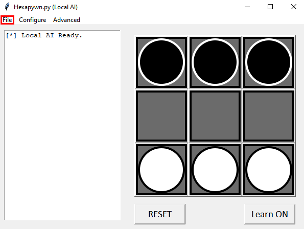

# Saving and Loading AI

In order to allow for AI to be created and preserved, there are built-in functions to save and load AI from `.hexai` files, the process for which is very simple using the GUI.

## Save an AI model

Click on the "File" button in the top-left corner and select "Save AI as...", then select your desired location in the File Explorer Window. You may want to check that location later on to make sure your AI saved successfully.

> **Note:** You won't be prompted to save your AI model when you close the app, nor is it automatically saved.

## Load an AI model

Click on "File" and select "Import Data". Select the file you want to use in the Explorer Window. A message will appear in the text pane, alerting you that your file has been loaded successfully. In order to save your changes, you will need to save and overwrite the original file.

## Reset the local AI

Say you want to use a Base Model for an AI, and create some new models which you wish to use differently, you can reset the AI currently being used. To reset, select "File" and then "Reset Current". You'll be reminded that this action is irreversible, but if you're sure, click "Yes, reset this AI.". You'll now have a completely new AI to work with.
